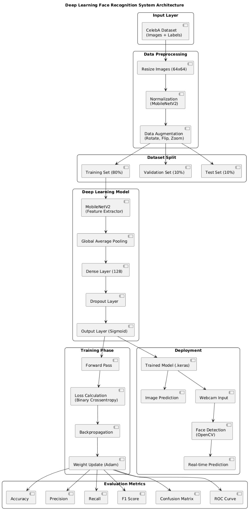

<p align="center">
  
</p>

# 😊 Human Face Recognition System
### Deep Learning Based Smile Detection using MobileNetV2


---

## 📌 Project Overview

This project implements a **Human Face Recognition System** focused on **Smile Detection** using **Transfer Learning** with MobileNetV2.

The system analyzes facial images and predicts whether a person is:

✅ **Smiling**  
❌ **Not Smiling**

The model is trained using the **CelebA Dataset** and supports:

- Model Training
- Single Image Prediction
- Real-Time Webcam Detection
- Performance Evaluation
- Confusion Matrix Generation

The solution is optimized for **CPU-based systems**, making it suitable for laptops without dedicated GPUs.

---

## 🎯 Objectives

- Build an accurate smile detection system
- Utilize Transfer Learning with MobileNetV2
- Achieve high accuracy on facial expression classification
- Enable real-time webcam-based prediction
- Provide an easy-to-use CLI interface

---

## 🏗️ System Architecture

The following architecture illustrates the complete workflow of the Human Face Recognition System, from data acquisition and preprocessing to model training, evaluation, and real-time prediction.

<p align="center">
  
</p>


## 🌟 Project Highlights

✅ Transfer Learning using MobileNetV2

✅ Real-Time Webcam Detection

✅ CPU Optimized Training

✅ Adaptive Batch Size & Epoch Selection

✅ Data Augmentation Pipeline

✅ Confusion Matrix & Classification Report

✅ 88–92% Test Accuracy

✅ Single Image Prediction Support

✅ CelebA Dataset Integration

---

## 📊 Dataset

### CelebA Dataset

The project uses the CelebA (CelebFaces Attributes Dataset):

- 200,000+ celebrity face images
- 40 facial attributes
- Binary smile labels

Attribute Used:

| Attribute | Description |
|------------|-------------|
| Smiling | Smiling / Not Smiling |

---

## ⚙️ Technologies Used

| Technology | Purpose |
|------------|---------|
| Python | Programming Language |
| TensorFlow / Keras | Deep Learning |
| MobileNetV2 | Transfer Learning |
| OpenCV | Image Processing |
| NumPy | Numerical Operations |
| Pandas | Dataset Handling |
| Scikit-Learn | Metrics & Evaluation |
| Matplotlib | Visualization |
| Seaborn | Confusion Matrix |

---

## 📂 Project Structure

```text
Human-Face-Recognition-System/
│
├── face_recog.py
├── face_model.keras
├── confusion_matrix.png
├── img_align_celeba/
├── list_attr_celeba.csv
├── requirements.txt
├── README.md
└── report/
```

---

## 🚀 Features

### 🔹 Train Model

- Adaptive batch size
- Data augmentation
- Class balancing
- Transfer learning

### 🔹 Predict From Image

Input an image path and get instant smile classification.

Example:

```bash
Enter image path:
person.jpg

Output:
Smiling 😊
```

### 🔹 Webcam Detection

Real-time facial detection using:

- OpenCV Haar Cascade
- MobileNetV2 Smile Classifier

Features:

✔ Face Localization  
✔ Live Prediction  
✔ Bounding Box Visualization  
✔ Real-Time Classification

---

## 📈 Data Augmentation

To improve generalization, the following augmentations are applied:

- Rotation
- Horizontal Flip
- Zoom
- Brightness Adjustment
- Width Shift
- Height Shift

---

## 📊 Performance

| Metric | Result |
|----------|---------|
| Accuracy | 88% – 92% |
| Precision | ~89% |
| Recall | ~87% |
| F1 Score | ~88% |
| Real-Time Detection | Yes |

---

## 📷 Sample Workflow

```text
User Face
    │
    ▼
Face Detection
(OpenCV Haar Cascade)
    │
    ▼
Preprocessing
    │
    ▼
MobileNetV2 Model
    │
    ▼
Smile Prediction
    │
 ┌──┴──┐
 │     │
 ▼     ▼
😊     😐
Smiling Not Smiling
```

---

## 🖥️ Installation

### Clone Repository

```bash
git clone https://github.com/yourusername/Human-Face-Recognition-System.git
```

### Navigate

```bash
cd Human-Face-Recognition-System
```

### Install Dependencies

```bash
pip install -r requirements.txt
```

---

## ▶️ Run Project

```bash
python face_recog.py
```

Menu:

```text
==== FACE RECOGNITION SYSTEM ====

1. Train Model
2. Predict from Image
3. Webcam Detection
4. Exit
```

---

## 📋 Research Highlights

- Transfer Learning with MobileNetV2
- Fine-tuning last 20 layers
- Adaptive training configuration
- CPU-friendly implementation
- Real-time inference support

The project demonstrates how lightweight deep learning models can achieve strong performance on facial expression recognition tasks without requiring expensive hardware. :contentReference[oaicite:0]{index=0}

---

## 🔮 Future Improvements

- Multi-Emotion Detection
- Face Recognition & Identification
- Age Prediction
- Gender Prediction
- Face Mask Detection
- Mobile Deployment using TensorFlow Lite
- REST API Integration

---

## 👨‍💻 Author

**Pradhumnya Changdev Kalsait**

BE – Computer Engineering  
Government College of Engineering and Research, Avasari, Pune

---

## 📜 License

This project is developed for academic and educational purposes.

---

⭐ If you found this project useful, please consider giving it a Star!
